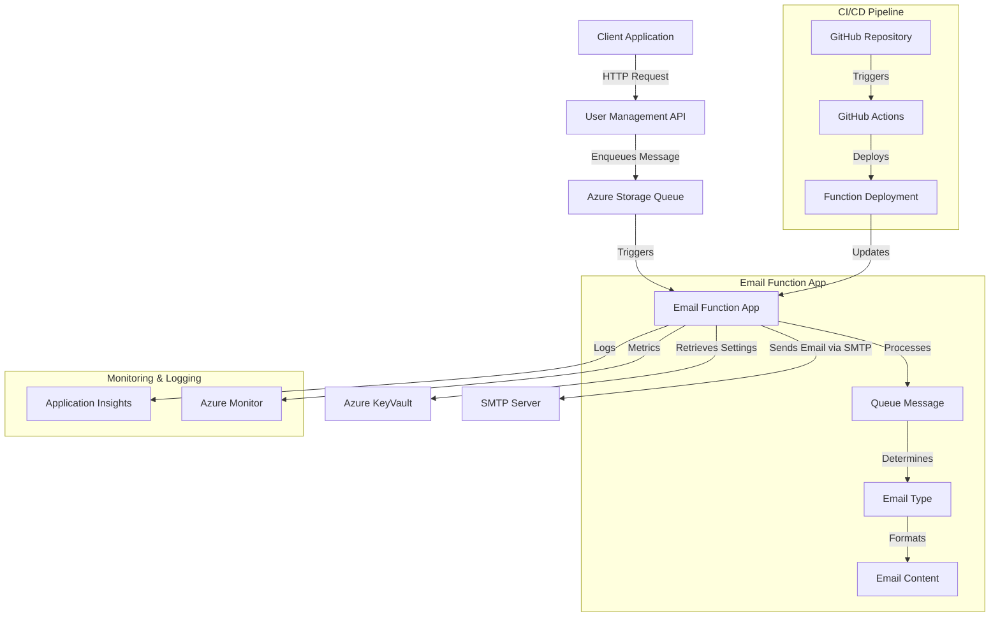
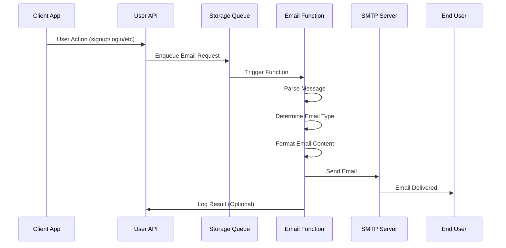

# 🏗️ Email Function App Architecture

## 📖 Overview

This document describes the comprehensive architecture of the Email Function App, a serverless notification system built on Azure Functions. The system implements event-driven architecture patterns for reliable, scalable email delivery through queue-triggered processing and SMTP integration.

---

## 🏛️ High-Level Architecture



The architecture implements a loosely coupled, event-driven design that ensures reliable email delivery while maintaining scalability and cost-effectiveness through serverless computing principles.

---

## 🧩 Core Components

### Email Queue Processor
- **Purpose**: Processes incoming email requests from Azure Storage Queue
- **Technology**: Azure Functions with Queue Trigger
- **Location**: `function_app.py`
- **Responsibilities**:
  - Message deserialization and validation
  - Email type routing and dispatch
  - Error handling and retry logic
  - Logging and monitoring integration

### SMTP Email Service
- **Purpose**: Handles email composition and delivery
- **Technology**: Python smtplib with TLS encryption
- **Location**: `helper_functions.py`
- **Responsibilities**:
  - SMTP server connection management
  - Email template rendering and formatting
  - Secure credential handling
  - Delivery confirmation and error reporting

### Configuration Management
- **Purpose**: Manages environment-specific settings and secrets
- **Technology**: Azure KeyVault + Environment Variables
- **Location**: Configuration scattered across function initialization
- **Responsibilities**:
  - SMTP server configuration
  - Authentication credentials
  - Email templates and content
  - Queue connection strings

---

## 🔄 Data Flow & Processing

### Message Processing Workflow



### Message Structure

```json
{
  "action": "signup|login|logout|password_reset|account_deletion",
  "user_email": "user@example.com",
  "user_name": "John Doe",
  "timestamp": "2024-06-24T10:30:00Z",
  "additional_data": {
    "reset_token": "optional-token",
    "login_ip": "192.168.1.1",
    "user_agent": "Mozilla/5.0..."
  }
}
```

---

## 📧 Email Types and Templates

The system supports comprehensive email notifications for user lifecycle management:

### User Authentication Flow
- **Registration Welcome**: Welcome emails for new users with account verification
- **Login Notification**: Security alerts for successful account access
- **Logout Confirmation**: Session termination notifications
- **Failed Login Alert**: Security notifications for failed login attempts

### Account Management
- **Password Reset Request**: Secure password reset with time-limited tokens
- **Password Change Confirmation**: Verification of successful password updates
- **Account Deletion Confirmation**: Final confirmation of account removal
- **Email Verification**: Account email address verification flows

### General Notifications
- **System Notifications**: Important system updates and maintenance alerts
- **Custom Messages**: Flexible template system for custom notifications

Each email type implements:
- **Personalized Content**: Dynamic user data integration
- **Responsive Templates**: Mobile-friendly HTML/text formats
- **Security Tokens**: Time-limited verification tokens where applicable
- **Tracking Support**: Email delivery and open tracking capabilities

---

## 🔒 Security Architecture

### Authentication & Authorization
- **Azure Managed Identity**: Secure service-to-service authentication
- **KeyVault Integration**: Centralized secret management for SMTP credentials
- **Environment Isolation**: Separate configurations for dev/staging/production
- **Access Control**: Function-level authentication with Azure AD

### Data Protection
- **TLS Encryption**: End-to-end encryption for SMTP communications
- **Input Validation**: Comprehensive validation of queue message content
- **Credential Rotation**: Automated rotation of SMTP passwords
- **Audit Logging**: Complete audit trail of email processing activities

### Network Security
- **VNet Integration**: Optional virtual network isolation
- **Private Endpoints**: Secure communication with Azure services
- **IP Restrictions**: Function access control by IP whitelist
- **CORS Configuration**: Controlled cross-origin access policies

---

## 🚀 Deployment Architecture

### Infrastructure as Code
- **ARM Templates**: Azure Resource Manager deployment templates
- **GitHub Actions**: Automated CI/CD pipeline with staging deployments
- **Environment Promotion**: Controlled promotion through dev → staging → production
- **Rollback Strategy**: Automated rollback on deployment failures

### Scalability & Performance
- **Auto-scaling**: Dynamic scaling based on queue length and processing time
- **Performance Monitoring**: Real-time performance metrics and alerting
- **Resource Optimization**: Cost-effective resource allocation and management
- **Load Testing**: Automated performance testing in CI/CD pipeline

### Monitoring & Observability
- **Application Insights**: Comprehensive application performance monitoring
- **Custom Metrics**: Business-specific metrics for email delivery success rates
- **Alert Rules**: Proactive alerting for failures and performance degradation
- **Log Analytics**: Centralized logging with correlation IDs for tracing

---

## 🔧 Technical Considerations

### Error Handling Strategy
- **Retry Logic**: Exponential backoff for transient failures
- **Dead Letter Queue**: Failed message handling and manual intervention
- **Circuit Breaker**: Protection against cascading failures
- **Graceful Degradation**: Fallback mechanisms for service unavailability

### Performance Optimization
- **Connection Pooling**: Efficient SMTP connection management
- **Batch Processing**: Bulk email processing for high-volume scenarios
- **Caching Strategy**: Template and configuration caching
- **Resource Limits**: Appropriate timeout and memory allocation

### Maintenance & Operations
- **Health Checks**: Automated health monitoring and reporting
- **Backup Strategy**: Configuration and template backup procedures
- **Disaster Recovery**: Multi-region deployment for business continuity
- **Documentation**: Comprehensive operational runbooks and procedures

---

*This architecture ensures reliable, secure, and scalable email delivery while maintaining operational excellence and cost-effectiveness.*
```